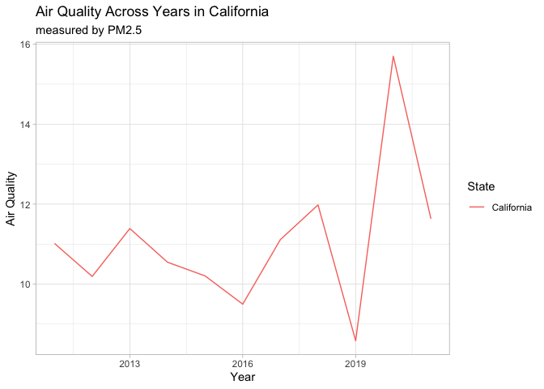

Project 2
================
Furred Flies (Caleb Weis, Eva Wu, Jimin Han)

This file explains the structure of the repository. This file will
include our write-up.

## Repo organization

-   [proposal](proposal) folder. This folder includes the RMarkDown and
    knitted MarkDown documents which contain the information in this
    proposal.

-   [data_cleaning_description](data_cleaning_description) folder. This
    folder contains RMarkDown documents used to load, examine, and
    wrangle data from the RAQSAPI and to load data from other sources,
    the csv files of data loaded from other sources, as well as the
    README file consisting of the codebook.

-   [air_quality](air_quality) folder. This folder contains an
    [app.R](air_quality/app.R) document consisting of the code used to
    build the app and a [data](air_quality/data) folder consisting of
    the data we used to make visualizations in the app.

-   We have a README.Rmd and README.md file for each folder. These files
    explain the structure of the repository. The README files in the
    main directory will include our write-up.

``` r
# experimenting w/ Cali data
ex <- read_csv("air_quality/data/CA1_avg.csv") %>%
  select(-row) %>%
  unique()
```

    ## Rows: 113670 Columns: 19
    ## ── Column specification ────────────────────────────────────────────────────────
    ## Delimiter: ","
    ## chr  (6): state_code, county_code, county, state, cbsa, year_qtr
    ## dbl (13): year, quarter, latitude, longitude, cbsa_code, row, PM2.5, Accepta...
    ## 
    ## ℹ Use `spec()` to retrieve the full column specification for this data.
    ## ℹ Specify the column types or set `show_col_types = FALSE` to quiet this message.

``` r
input <- c()
input$state <- c("California")
input$pollutant <- "PM2.5"

state_filtered <- ex %>%
  filter(state %in% input$state) %>%
  select(year, quarter, state, year_qtr, input$pollutant) %>%
  unique() %>%
  group_by(year, state) %>%
  summarize(air_qual_year = mean(PM2.5, na.rm = TRUE))
```

    ## `summarise()` has grouped output by 'year'. You can override using the
    ## `.groups` argument.

``` r
state_filtered %>%
  ggplot(aes(year, air_qual_year, color = state)) +
  geom_line() +
  theme_light() +
  labs(title = paste("Air Quality Across Years in", input$state),
       subtitle = paste("measured by", input$pollutant),
       x = "Year", y = "Air Quality", color = "State")
```

<!-- -->
